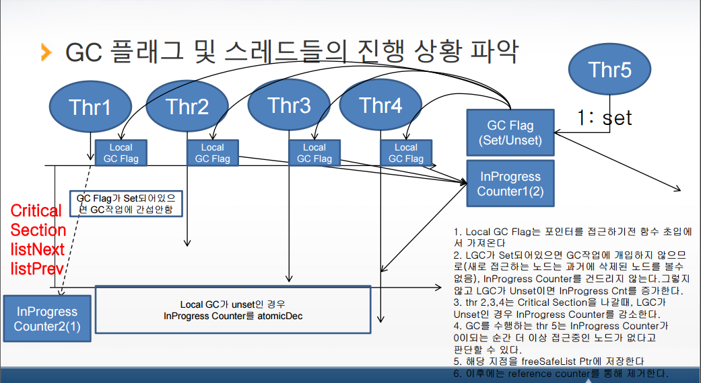
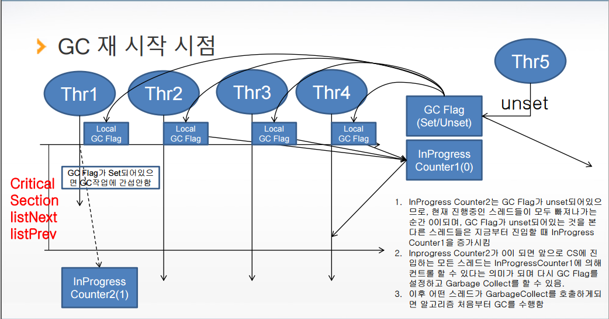

THREAD SAFE LOCK FREE DOUBLE LINKED LIST MEMORY FREE ALGORITHM 

(PROGRESS COUNTER  ALGORITHM) 

**차례** 

- 개념 소개 
- 인터페이스 및 자료구조 
- 핵심 알고리즘 
- 규칙 
- 검증 결과 
- 정리 

**개념** **소개** 

- Reference counter를 사용하여 기본적인 메모리 해제 방지 
- 리스트 접근 시 자동으로 Garbage Collector 함수가 호출되어 쓰 레기 노드가 특정 개수 이상 쌓이는 경우 메모리 해제 정리 작업 수행 
- 사용자는 따로 Garbage Collector를 호출할 필요 없음.  
- Reference counter가 0이지만 다른 스레드가 리스트에 연결되어 있는 노드에 대한 접근을 할 때 발생하는 문제를 해결하는 방법 
- 메모리 해제 가능한 노드를 파악하기 위해서 리스트에 현 시점에서 접근 가능한 스레드에 대한 카운터를 사용함.  
- 스레드들은 리스트에 접근하기 전에 카운터를 증가시키고 리스트 접근이 완료되면 카운터를 감소시킴 
- 특정 스레드가 Garbage Collector를 수행할 때 진행중인 스레드가 모두 리스트 접근을 완료한 시점에 메모리 해제를 수행함. 

**인터페이스** **및** **자료구조** 

- 인터페이스
- 기존의 인터페이스에 변경사항 없음 

자료구조 

typedef struct acl\_safelist\_node\_t { 

`    `struct acl\_safelist\_node\_t\*     mPrev;      /\* Previous Node \*/

`    `struct acl\_safelist\_node\_t\*     mNext;      /\* <Next Node, Deleted> \*/     acp\_uint32\_t                    mRefCnt;    /\* refernce count\*/ 

`    `void\*                           mData;      /\* Data pointer \*/

`    `acp\_list\_t                      mFreeNode;  /\* node for free \*/

} acl\_safelist\_node\_t; 

typedef struct acl\_safelist\_t { 

`    `acl\_safelist\_node\_t         mHead;           /\* Head Dummy Node \*/     acl\_safelist\_node\_t         mTail;           /\* Tail Dummy Node \*/

`    `/\* only one thr can delete free list item \*/

`    `acp\_list\_t                  mFreeList;       /\* Deleted node list \*/

`    `acp\_uint16\_t                mDoingFreeFlag;  /\* can this thr free free list \*/ 

`    `acp\_uint16\_t                mFreeJobLevel;   /\* GC job level \*/

`    `acp\_list\_node\_t\*           mStartFreePos;   /\* position to start free node \*/

`    `acp\_uint32\_t                mGCFlag;         /\* flag for GC\*/

`    `acp\_uint32\_t                mInProgressCounter; /\* counts of thread searching list \*/

`    `acp\_uint32\_t                mInProgressCounter2; /\* counts of thread searching list  during GC job\*/ } acl\_safelist\_t; 

**핵심** **알고리즘** 3 

GC 플래그 및 스레드들의 진행 상황 파악  

1. Local GC Flag는 포인터를 접근하기전 함수 초입에서 가져온다 
2. LGC가 Set되어있으면 GC작업에 개입하지 않으므로로(새로 접근하는 노드는 과거에 삭제된 노드를 볼수 없음), InProgress Counter를 건드리지 않는다.그렇지 않고 LGC가 Unset이면 InProgress Cnt를 증가한다. 
3. thr 2,3,4는 Critical Section을 나갈때, LGC가 InProgress  InProgress Counter를 atomicDec  Unset인 경우 InProgress Counter를 감소한다.  
4. GC를 수행하는 thr 5는 InProgress Counter가  0이되는 순간 더 이상 접근중인 노드가 없다고  판단할 수 있다.  

5. 해당 지점을 freeSafeList Ptr에 저장한다 
6. 이후에는 reference counter를 통해 제거한다. 

GC 재 시작 시점  

1. InProgress Counter2는 GC Flag가 unset되어있으 listNext  므로, 현재 진행중인 스레드들이 모두 빠져나가는

순간 0이되며, GC Flag가 unset되어있는 것을 본 listPrev  다른 스레드들은 지금부터 진입할 때 InProgress 

Counter1을 증가시킴 

2. Inprogress Counter2가 0이 되면 앞으로 CS에 진 입하는 모든 스레드는 InProgressCounter1에 의해 컨트롤 할 수 있다는 의미가 되며 다시 GC Flag를 InProgress  설정하고 Garbage Collect를 할 수 있음.  Counter2(1)  3. 이후 어떤 스레드가 GarbageCollect를 호출하게되 면 알고리즘 처음부터 GC를 수행함  

**규칙** 

- Reference Counter의 오동작을 방지하기 위해 서 리스트를 접근하는 스레드들은 특정 노드를 검색해서 사용한 후 스레드가 종료되기 전에 다 음의 두 가지 작업 중 하나를 반드시 수행해야 한다.  
- 접근중인 노드 delete  
- 리스트 tail 혹은 head까지 검색 
- Reference counter를 사용하며, 특정 노드를 접 근해서 가져갈 때 1을 증가시키고, 다음 노드를 접근할 때 감소, 혹은 delete할 때 감소시킨다. 그러므로, 위의 두 가지 규칙을 지킨다면 reference counter의 오동작을 예방할 수 있다. 

**검증결과** 

- 테스트 프로그램을 수행하였을 이 모든 메모리가 해제되었음을

 때 다음과 같

` `확인하였음. 

==6946== 

==6946== HEAP SUMMARY: 

==6946==     in use at exit: 0 bytes in 0 blocks

==6946==   total heap usage: 67,109,121 allocs, 67,109,121 frees, 2,415,994,880 bytes allocated ==6946== 

==6946== All heap blocks were freed -- no leaks are possible

==6946== 

==6946== For counts of detected and suppressed errors, rerun with: -v 

==6946== ERROR SUMMARY: 0 errors from 0 contexts (suppressed: 4 from 4)

**정리** 

- 장점  
- GC를 위해 추가로 들어가는 메모리가 크지 않아 공 간 효율적임 

• Counter 및 기타 컨트롤 변수 몇 가지 정도 

- 리스트를 접근하는 스레드는 특정 counter변수 세 개를 접근하는 작업만이 추가되므로 성능에 크게 영 향을 미치지 않을 것으로 예측됨 
- 단점 
- Reference counter 오동작을 방지하기 위해 스레드 가 접근 규칙을 지켜야 하며 그렇지 않는 경우 메모 리 누수가 있을 수 있음. 

