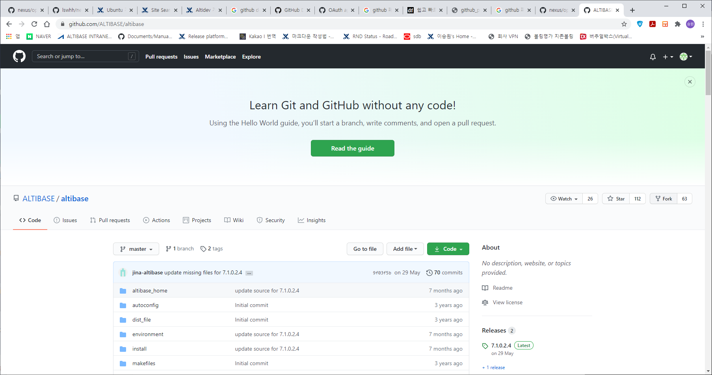
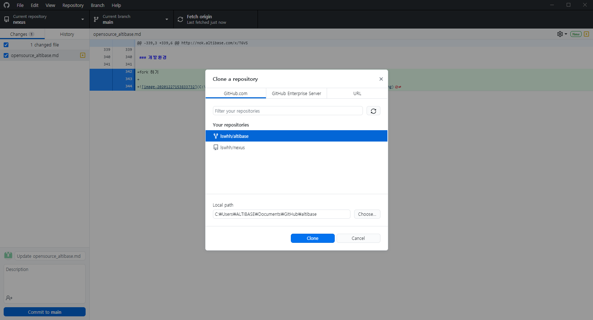

# [ opensource altibase compile test ]

### WSL 20.04 설치

설치는 windows 10에서 app store에서 linux 검색해서 설치하면 된다. 

설치시 기본 admin 계정 비밀번호를 입력하고 마친다. 

### WSL 설치 후 패키지 설치

##### sudo apt update와 sudo apt upgrade

lswhh@DESKTOP-HQPQNKV:~$ sudo apt update
Get:1 http://security.ubuntu.com/ubuntu focal-security InRelease [109 kB]
Hit:2 http://archive.ubuntu.com/ubuntu focal InRelease
Get:3 http://archive.ubuntu.com/ubuntu focal-updates InRelease [114 kB]
Get:4 http://security.ubuntu.com/ubuntu focal-security/main amd64 Packages [395 kB]
Get:5 http://security.ubuntu.com/ubuntu focal-security/main Translation-en [90.4 kB]
Get:6 http://security.ubuntu.com/ubuntu focal-security/main amd64 c-n-f Metadata [5584 B]
Get:7 http://security.ubuntu.com/ubuntu focal-security/restricted amd64 Packages [80.7 kB]
Get:8 http://security.ubuntu.com/ubuntu focal-security/restricted Translation-en [12.8 kB]
Get:9 http://security.ubuntu.com/ubuntu focal-security/universe amd64 Packages [521 kB]
Get:10 http://archive.ubuntu.com/ubuntu focal-backports InRelease [101 kB]
Get:11 http://security.ubuntu.com/ubuntu focal-security/universe Translation-en [68.6 kB]
Get:12 http://security.ubuntu.com/ubuntu focal-security/universe amd64 c-n-f Metadata [9364 B]
Get:13 http://security.ubuntu.com/ubuntu focal-security/multiverse amd64 Packages [1256 B]
Get:14 http://security.ubuntu.com/ubuntu focal-security/multiverse Translation-en [540 B]
Get:15 http://security.ubuntu.com/ubuntu focal-security/multiverse amd64 c-n-f Metadata [116 B]
Get:16 http://archive.ubuntu.com/ubuntu focal/universe amd64 Packages [8628 kB]
Get:17 http://archive.ubuntu.com/ubuntu focal/universe Translation-en [5124 kB]
Get:18 http://archive.ubuntu.com/ubuntu focal/universe amd64 c-n-f Metadata [265 kB]
Get:19 http://archive.ubuntu.com/ubuntu focal/multiverse amd64 Packages [144 kB]
Get:20 http://archive.ubuntu.com/ubuntu focal/multiverse Translation-en [104 kB]
Get:21 http://archive.ubuntu.com/ubuntu focal/multiverse amd64 c-n-f Metadata [9136 B]
Get:22 http://archive.ubuntu.com/ubuntu focal-updates/main amd64 Packages [699 kB]
Get:23 http://archive.ubuntu.com/ubuntu focal-updates/main Translation-en [176 kB]
Get:24 http://archive.ubuntu.com/ubuntu focal-updates/main amd64 c-n-f Metadata [11.3 kB]
Get:25 http://archive.ubuntu.com/ubuntu focal-updates/restricted amd64 Packages [103 kB]
Get:26 http://archive.ubuntu.com/ubuntu focal-updates/restricted Translation-en [15.8 kB]
Get:27 http://archive.ubuntu.com/ubuntu focal-updates/restricted amd64 c-n-f Metadata [348 B]
Get:28 http://archive.ubuntu.com/ubuntu focal-updates/universe amd64 Packages [708 kB]
Get:29 http://archive.ubuntu.com/ubuntu focal-updates/universe Translation-en [140 kB]
Get:30 http://archive.ubuntu.com/ubuntu focal-updates/universe amd64 c-n-f Metadata [13.7 kB]
Get:31 http://archive.ubuntu.com/ubuntu focal-updates/multiverse amd64 Packages [20.0 kB]
Get:32 http://archive.ubuntu.com/ubuntu focal-updates/multiverse Translation-en [4668 B]
Get:33 http://archive.ubuntu.com/ubuntu focal-updates/multiverse amd64 c-n-f Metadata [552 B]
Get:34 http://archive.ubuntu.com/ubuntu focal-backports/main amd64 c-n-f Metadata [112 B]
Get:35 http://archive.ubuntu.com/ubuntu focal-backports/restricted amd64 c-n-f Metadata [116 B]
Get:36 http://archive.ubuntu.com/ubuntu focal-backports/universe amd64 Packages [3988 B]
Get:37 http://archive.ubuntu.com/ubuntu focal-backports/universe Translation-en [1448 B]
Get:38 http://archive.ubuntu.com/ubuntu focal-backports/universe amd64 c-n-f Metadata [224 B]
Get:39 http://archive.ubuntu.com/ubuntu focal-backports/multiverse amd64 c-n-f Metadata [116 B]
Fetched 17.7 MB in 7s (2453 kB/s)
Reading package lists... Done
Building dependency tree
Reading state information... Done
142 packages can be upgraded. Run 'apt list --upgradable' to see them.

lswhh@DESKTOP-HQPQNKV:~$ sudo apt upgrade
Reading package lists... Done
Building dependency tree
Reading state information... Done
Calculating upgrade... Done
The following NEW packages will be installed:
  motd-news-config python3-pexpect python3-ptyprocess
The following packages will be upgraded:
  accountsservice alsa-ucm-conf apport apt apt-utils base-files bcache-tools bind9-dnsutils bind9-host bind9-libs bolt
  bsdutils busybox-initramfs busybox-static ca-certificates cloud-init command-not-found cryptsetup cryptsetup-bin
  cryptsetup-initramfs cryptsetup-run curl distro-info-data fdisk finalrd gcc-10-base gir1.2-packagekitglib-1.0
  initramfs-tools initramfs-tools-bin initramfs-tools-core krb5-locales language-selector-common libaccountsservice0
  libapt-pkg6.0 libasound2 libasound2-data libblkid1 libbrotli1 libc-bin libc6 libcryptsetup12 libcurl3-gnutls
  libcurl4 libdns-export1109 libefiboot1 libefivar1 libfdisk1 libfreetype6 libgcc-s1 libgl1 libglvnd0 libglx0
  libgnutls30 libgssapi-krb5-2 libisc-export1105 libk5crypto3 libkrb5-3 libkrb5support0 libldap-2.4-2 libldap-common
  liblzma5 libmaxminddb0 libmount1 libnetplan0 libnss-systemd libpackagekit-glib2-18 libpam-modules libpam-modules-bin
  libpam-runtime libpam-systemd libpam0g libparted2 libperl5.30 libplymouth5 libproxy1v5 libpulse0 libpulsedsp
  libpython3.8 libpython3.8-minimal libpython3.8-stdlib libsmartcols1 libssl1.1 libstdc++6 libsystemd0 libudev1
  libuuid1 libuv1 libx11-6 libx11-data libx11-xcb1 locales mdadm mount netplan.io open-vm-tools openssl packagekit
  packagekit-tools parted perl perl-base perl-modules-5.30 plymouth plymouth-theme-ubuntu-text pulseaudio-utils
  python-apt-common python3-apport python3-apt python3-commandnotfound python3-cryptography python3-distupgrade
  python3-distutils python3-gdbm python3-lib2to3 python3-problem-report python3-software-properties python3-urllib3
  python3.8 python3.8-minimal rsyslog show-motd snapd software-properties-common sosreport sudo systemd systemd-sysv
  systemd-timesyncd tmux tzdata ubuntu-minimal ubuntu-release-upgrader-core ubuntu-server ubuntu-standard ubuntu-wsl
  udev unattended-upgrades update-motd util-linux uuid-runtime xz-utils zlib1g
142 upgraded, 3 newly installed, 0 to remove and 0 not upgraded.
Need to get 78.5 MB of archives.
After this operation, 9127 kB of additional disk space will be used.
Do you want to continue? [Y/n]Y

update-rc.d: warning: start and stop actions are no longer supported; falling back to defaults
Setting up libnss-systemd:amd64 (245.4-4ubuntu3.3) ...
Setting up plymouth-theme-ubuntu-text (0.9.4git20200323-0ubuntu6.2) ...
update-initramfs: deferring update (trigger activated)
Setting up libpam-systemd:amd64 (245.4-4ubuntu3.3) ...
Setting up ubuntu-standard (1.450.2) ...
Processing triggers for man-db (2.9.1-1) ...
Processing triggers for dbus (1.12.16-2ubuntu2.1) ...
Processing triggers for install-info (6.7.0.dfsg.2-5) ...
Processing triggers for mime-support (3.64ubuntu1) ...
Processing triggers for libc-bin (2.31-0ubuntu9.1) ...
Processing triggers for ca-certificates (20201027ubuntu0.20.04.1) ...
Updating certificates in /etc/ssl/certs...
0 added, 0 removed; done.
Running hooks in /etc/ca-certificates/update.d...
done.
Processing triggers for initramfs-tools (0.136ubuntu6.3) ...

##### 로케일 언어 설정

sudo dpkg-reconfigure locales

* en_US.UTF-8 UTF-8
* ko_KR.EUC-KR EUC-KR
* ko_KR.UTF-8 UTF-8

3가지 선택(나머지는 모두 해제)후 기본 언어로 ko_KR.UTF-8 UTF-8 를 선택

```
[옵션]
윈도우와의 파일 공유 등 몇몇 이유로 시스템 기본 로케일을 euc-kr 로 했을 때 가장 큰 문제점은 nautilus 에서 파일을 만들면, 해당 파일명의 인코딩이 항상 UTF-8 로 된다는 것입니다.
이 경우, 노틸러스의 기본 파일 인코딩을 euc-kr 로 바꿔 주면 됩니다.
/etc/environment 에 다음의 라인을 추가합니다 :

G_FILENAME_ENCODING=eucKR

그리고, 시스템을 재시작하면, 노틸러스에서 한글 파일명을 생성해도 파일명의 encoding 이 eucKR 로 되어서 생성됩니다. (wsl은 잘 모르겠음)
```


###### 로케일 언어 설정을 위한 패키지 설치

lswhh@DESKTOP-HQPQNKV:~$ sudo apt-get install language-pack-ko
Reading package lists... Done
Building dependency tree
Reading state information... Done
The following additional packages will be installed:
  language-pack-ko-base
The following NEW packages will be installed:
  language-pack-ko language-pack-ko-base
0 upgraded, 2 newly installed, 0 to remove and 0 not upgraded.
Need to get 933 kB of archives.
After this operation, 4018 kB of additional disk space will be used.
Do you want to continue? [Y/n] Y
Get:1 http://archive.ubuntu.com/ubuntu focal-updates/main amd64 language-pack-ko-base all 1:20.04+20200709 [931 kB]
52% [1 language-pack-ko-base 604 kB/931 kB 65%]

lswhh@DESKTOP-HQPQNKV:~$ sudo locale-gen ko_KR.EUC-KR
Generating locales (this might take a while)...
  ko_KR.EUC-KR... done
Generation complete.
lswhh@DESKTOP-HQPQNKV:~$ sudo /var/lib/locales/supported.d/ko
sudo: /var/lib/locales/supported.d/ko: command not found
lswhh@DESKTOP-HQPQNKV:~$ sudo vi /var/lib/locales/supported.d/ko
sudo vi /var/lib/locales/supported.d/ko 하단에 "ko_KR.EUC-KR EUC-KR" 추가
sudo dpkg-reconfigure locales
lswhh@DESKTOP-HQPQNKV:~$ sudo dpkg-reconfigure locales
Generating locales (this might take a while)...
  en_US.UTF-8... done
  ko_KR.EUC-KR... done
  ko_KR.UTF-8... done

###### 한글 입력기 nabi 설치

lswhh@DESKTOP-HQPQNKV:~$ sudo apt install nabi
Reading package lists... Done
Building dependency tree
Reading state information... Done
The following additional packages will be installed:
  adwaita-icon-theme fontconfig gtk-update-icon-cache hicolor-icon-theme humanity-icon-theme libatk1.0-0
  libatk1.0-data libavahi-client3 libavahi-common-data libavahi-common3 libcairo-gobject2 libcairo2 libcups2
  libdatrie1 libgail-common libgail18 libgdk-pixbuf2.0-0 libgdk-pixbuf2.0-bin libgdk-pixbuf2.0-common libgraphite2-3
  libgtk2.0-0 libgtk2.0-bin libgtk2.0-common libhangul-data libhangul1 libharfbuzz0b libjbig0 libjpeg-turbo8 libjpeg8
  libpango-1.0-0 libpangocairo-1.0-0 libpangoft2-1.0-0 libpixman-1-0 librsvg2-2 librsvg2-common libthai-data libthai0
  libtiff5 libwebp6 libxcb-render0 libxcb-shm0 libxcursor1 ubuntu-mono
Suggested packages:
  cups-common gvfs librsvg2-bin imhangul-gtk2 | imhangul-gtk3
The following NEW packages will be installed:
  adwaita-icon-theme fontconfig gtk-update-icon-cache hicolor-icon-theme humanity-icon-theme libatk1.0-0
  libatk1.0-data libavahi-client3 libavahi-common-data libavahi-common3 libcairo-gobject2 libcairo2 libcups2
  libdatrie1 libgail-common libgail18 libgdk-pixbuf2.0-0 libgdk-pixbuf2.0-bin libgdk-pixbuf2.0-common libgraphite2-3
  libgtk2.0-0 libgtk2.0-bin libgtk2.0-common libhangul-data libhangul1 libharfbuzz0b libjbig0 libjpeg-turbo8 libjpeg8
  libpango-1.0-0 libpangocairo-1.0-0 libpangoft2-1.0-0 libpixman-1-0 librsvg2-2 librsvg2-common libthai-data libthai0
  libtiff5 libwebp6 libxcb-render0 libxcb-shm0 libxcursor1 nabi ubuntu-mono
0 upgraded, 44 newly installed, 0 to remove and 0 not upgraded.
Need to get 14.4 MB of archives.
After this operation, 67.0 MB of additional disk space will be used.
Do you want to continue? [Y/n] Y

###### nabi 설정

cd ~
vi .gnomerc
export XMODIFIERS="@im=nabi"
export GTK_IM_MODULE=xim
export VTE_USE_XFT=0

##### kde language pack 설치

lswhh@DESKTOP-HQPQNKV:~$ sudo apt install language-pack-kde-ko
Reading package lists... Done
Building dependency tree
Reading state information... Done
The following additional packages will be installed:
  k3b-i18n
The following NEW packages will be installed:
  k3b-i18n language-pack-kde-ko
0 upgraded, 2 newly installed, 0 to remove and 0 not upgraded.
Need to get 3731 kB of archives.
After this operation, 16.6 MB of additional disk space will be used.
Do you want to continue? [Y/n]

##### ssh 서버 재설치

lswhh@DESKTOP-HQPQNKV:~$ sudo apt purge openssh-server
Reading package lists... Done
Building dependency tree
Reading state information... Done
The following packages will be REMOVED:
  openssh-server*
0 upgraded, 0 newly installed, 1 to remove and 0 not upgraded.
After this operation, 1527 kB disk space will be freed.
Do you want to continue? [Y/n] Y
(Reading database ... 46734 files and directories currently installed.)
Removing openssh-server (1:8.2p1-4ubuntu0.1) ...
invoke-rc.d: could not determine current runlevel

 * Stopping OpenBSD Secure Shell server sshd                                                                     [ OK ]
Processing triggers for man-db (2.9.1-1) ...
(Reading database ... 46716 files and directories currently installed.)
Purging configuration files for openssh-server (1:8.2p1-4ubuntu0.1) ...
Processing triggers for systemd (245.4-4ubuntu3.3) ...
Processing triggers for ufw (0.36-6) ...

lswhh@DESKTOP-HQPQNKV:~$ sudo apt-get install openssh-server
Reading package lists... Done
Building dependency tree
Reading state information... Done
Suggested packages:
  molly-guard monkeysphere ssh-askpass
The following NEW packages will be installed:
  openssh-server
0 upgraded, 1 newly installed, 0 to remove and 0 not upgraded.
Need to get 377 kB of archives.
After this operation, 1527 kB of additional disk space will be used.
Get:1 http://archive.ubuntu.com/ubuntu focal-updates/main amd64 openssh-server amd64 1:8.2p1-4ubuntu0.1 [377 kB]
Fetched 377 kB in 2s (163 kB/s)
Preconfiguring packages ...
Selecting previously unselected package openssh-server.
(Reading database ... 46711 files and directories currently installed.)
Preparing to unpack .../openssh-server_1%3a8.2p1-4ubuntu0.1_amd64.deb ...
Unpacking openssh-server (1:8.2p1-4ubuntu0.1) ...
Setting up openssh-server (1:8.2p1-4ubuntu0.1) ...

Creating config file /etc/ssh/sshd_config with new version
Creating SSH2 RSA key; this may take some time ...
3072 SHA256:WJyT7eQ1HpNhn7Llxtq2sZwbJOyLWRrbqB+tpGTN2vI root@DESKTOP-HQPQNKV (RSA)
Creating SSH2 ECDSA key; this may take some time ...
256 SHA256:8GWM2WNqQedSEz0T3ztvcYJu8U+Z6fr2GF3355xJipM root@DESKTOP-HQPQNKV (ECDSA)
Creating SSH2 ED25519 key; this may take some time ...
256 SHA256:jHQmnmA2MtqSMPZi2zJeURXOs4vafjSQJes0qzQaedQ root@DESKTOP-HQPQNKV (ED25519)
Created symlink /etc/systemd/system/sshd.service → /lib/systemd/system/ssh.service.
Created symlink /etc/systemd/system/multi-user.target.wants/ssh.service → /lib/systemd/system/ssh.service.
invoke-rc.d: could not determine current runlevel
Processing triggers for systemd (245.4-4ubuntu3.3) ...
Processing triggers for man-db (2.9.1-1) ...

###### ssh 서버 설정 및 재시작

lswhh@DESKTOP-HQPQNKV:~$ sudo vi /etc/ssh/sshd_config
/etc/ssh/sshd_config <-- 아래 라인 주석 해제 확인
Port 22
PermitRootLogin prohibit-password  
AuthorizedKeysFile      .ssh/authorized_keys .ssh/authorized_keys2
PasswordAuthentication yes
PubkeyAuthentication yes
ChallengeResponseAuthentication no
X11Forwarding yes
UseDNS no
lswhh@DESKTOP-HQPQNKV:~$ sudo service ssh --full-restart
vice ssh restart * Stopping OpenBSD Secure Shell server sshd                                                     [ OK ]

Starting OpenBSD Secure Shell server sshd                                                                     [ OK ]
lswhh@DESKTOP-HQPQNKV:~$ sudo service ssh restart

Restarting OpenBSD Secure Shell server sshd                                                                   [ OK ]

##### 한영키 설정

 xev 프로그램 실행 후 한영키와 한자키 코드 확인 
 lswhh@DESKTOP-HQPQNKV:~$ xev
 한영 64
 한자 37
xmodmap -e "keycode 64 = Hangul"
xmodmap -e "keycode 37 = Hangul_Hanja"

lswhh@DESKTOP-HQPQNKV:~$ vi ~/.Xmodmap 에 아래 내용 저장
keycode 64 = Hangul
keycode 37 = Hangul_Hanja

##### 은폰트 설치

lswhh@DESKTOP-HQPQNKV:~$ sudo apt install fonts-unfonts-core
패키지 목록을 읽는 중입니다... 완료
의존성 트리를 만드는 중입니다
상태 정보를 읽는 중입니다... 완료
다음 새 패키지를 설치할 것입니다:
  fonts-unfonts-core
0개 업그레이드, 1개 새로 설치, 0개 제거 및 0개 업그레이드 안 함.
14.9 M바이트 아카이브를 받아야 합니다.
이 작업 후 34.3 M바이트의 디스크 공간을 더 사용하게 됩니다.
받기:1 http://archive.ubuntu.com/ubuntu focal/universe amd64 fonts-unfonts-core all 1:1.0.2-080608-16 [14.9 MB]
lswhh@DESKTOP-HQPQNKV:~$ sudo apt install fonts-unfonts-extra
패키지 목록을 읽는 중입니다... 완료
의존성 트리를 만드는 중입니다
상태 정보를 읽는 중입니다... 완료
다음 새 패키지를 설치할 것입니다:

##### [gcc-7, g++-7 설치]

lswhh@DESKTOP-HQPQNKV:~$ sudo apt install gcc-7
...
lswhh@DESKTOP-HQPQNKV:~$ sudo apt install g++-7
...
내려받기 11.2 M바이트, 소요시간 5초 (2,153 k바이트/초)
Selecting previously unselected package libstdc++-7-dev:amd64.
(데이터베이스 읽는중 ...현재 50996개의 파일과 디렉터리가 설치되어 있습니다.)
Preparing to unpack .../libstdc++-7-dev_7.5.0-6ubuntu2_amd64.deb ...
Unpacking libstdc++-7-dev:amd64 (7.5.0-6ubuntu2) ...
Selecting previously unselected package g++-7.
Preparing to unpack .../g++-7_7.5.0-6ubuntu2_amd64.deb ...
Unpacking g++-7 (7.5.0-6ubuntu2) ...
libstdc++-7-dev:amd64 (7.5.0-6ubuntu2) 설정하는 중입니다 ...
g++-7 (7.5.0-6ubuntu2) 설정하는 중입니다 ...
Processing triggers for man-db (2.9.1-1) ...
[build essential 설치]
lswhh@DESKTOP-HQPQNKV:~$ sudo apt install build-essential
여기까지 참고
http://nok.altibase.com/x/T6VS

### 개발환경

##### fork 하기



##### local에 clone 하기

windows에서 github desktop을 통해서 altibase opensource clone하기



default 경로로 아래 경로로 입력됨. 

C:\Users\ALTIBASE\Documents\GitHub\altibase

**주의: windows에서 다운받은 파일은 리턴 캐릭터로 인해서 configure에서 문제가 발생하므로, wsl에서 직접 git clone을 통해서 다운받아야 한다. 

linux에서 git clone하기

```
lswhh@DESKTOP-HQPQNKV:~/work$ git clone https://github.com/lswhh/altibase.git altibase
Cloning into 'altibase'...
remote: Enumerating objects: 1, done.
remote: Counting objects: 100% (1/1), done.
remote: Total 13996 (delta 0), reused 1 (delta 0), pack-reused 13995
Receiving objects: 100% (13996/13996), 109.77 MiB | 9.10 MiB/s, done.
Resolving deltas:  99% (9036/9127)
```


##### JAVA 설치

```
- Install both of Oracle Java JDK 1.5 and 1.7
  Go to https://www.oracle.com/technetwork/java/archive-139210.html
  JDK 1.5 : jdk-1_5_0_22-linux-amd64-rpm.bin or jdk-1_5_0_22-linux-amd64.bin
  JDK 1.7 : jdk-7u80-linux-x64.rpm or jdk-7u80-linux-x64.tar.gz
```

아래에 java 설치 완료, jdk1.5만 바이너리 실행 하면 압축 해제 됨. 

나머지는 tar로 압축 풀기

lswhh@DESKTOP-HQPQNKV:~$ pwd
/home/lswhh
lswhh@DESKTOP-HQPQNKV:~$ cd JAVA/
lswhh@DESKTOP-HQPQNKV:~/JAVA$ ls
jdk-11.0.8  jdk1.5.0_22  jdk1.7.0_80
lswhh@DESKTOP-HQPQNKV:~/JAVA$

##### Openssl 설치

```
- Install OpenSSL
  Remove existing openssl (Ubuntu 18.04 example)
    sudo mv /usr/include/openssl /usr/include/openssl.original
    sudo mv /usr/include/x86_64-linux-gnu/openssl /usr/include/x86_64-linux-gnu/openssl.original
  Download : https://www.openssl.org/source/openssl-1.0.2o.tar.gz
  Make a symbolic link : sudo ln -s /usr/local/ssl/include/openssl /usr/include/openssl
```

lswhh@DESKTOP-HQPQNKV:~/pkg$ pwd
/home/lswhh/pkg
lswhh@DESKTOP-HQPQNKV:~/pkg$ wget https://www.openssl.org/source/openssl-1.0.2o.tar.gz
--2020-12-27 21:01:05--  https://www.openssl.org/source/openssl-1.0.2o.tar.gz
Resolving www.openssl.org (www.openssl.org)... 104.74.201.89, 23.65.188.44, 23.53.2.175, ...
접속 www.openssl.org (www.openssl.org)|104.74.201.89|:443... 접속됨.
HTTP request sent, awaiting response... 200 OK
Length: 5329472 (5.1M) [application/x-gzip]
Saving to: ‘openssl-1.0.2o.tar.gz’

openssl-1.0.2o.tar.gz                      100%[=====================================================================================>]   5.08M  11.1MB/s    in 0.5s

2020-12-27 21:01:07 (11.1 MB/s) - ‘openssl-1.0.2o.tar.gz’ saved [5329472/5329472]

lswhh@DESKTOP-HQPQNKV:~/pkg$ tar xvzf openssl-1.0.2o.tar.gz

lswhh@DESKTOP-HQPQNKV:~/pkg$ ls
jdk-11.0.8_linux-x64_bin.tar.gz  jdk-1_5_0_22-linux-amd64.bin  jdk-7u80-linux-i586.tar.gz  openssl-1.0.2o  openssl-1.0.2o.tar.gz

** 설치는... 확인 필요 **

##### 개발에 필요한 툴 설치

```
- Install development tools
  sudo apt install autoconf autopoint help2man texinfo gawk flex bison
  .....
  libxml-sax-expat-perl (0.51-1) 설정하는 중입니다 ...
update-perl-sax-parsers: Registering Perl SAX parser XML::SAX::Expat with priority 50...
update-perl-sax-parsers: Updating overall Perl SAX parser modules info file...
Replacing config file /etc/perl/XML/SAX/ParserDetails.ini with new version
Processing triggers for install-info (6.7.0.dfsg.2-5) ...
Processing triggers for man-db (2.9.1-1) ...

  flex (2.5.35 version) (https://github.com/westes/flex/releases) (install method: https://github.com/westes/flex)
  bison (2.4.1 version) (http://ftp.gnu.org/gnu/bison/)
  sudo apt install libncurses5-dev binutils-dev ddd tkcvs manpages-dev libldap2-dev
  ...
  Processing triggers for libc-bin (2.31-0ubuntu9.1) ...
Processing triggers for man-db (2.9.1-1) ...
Processing triggers for install-info (6.7.0.dfsg.2-5) ...
Processing triggers for fontconfig (2.13.1-2ubuntu3) ...
Processing triggers for mime-support (3.64ubuntu1) ...

lswhh@DESKTOP-HQPQNKV:~/pkg$ which re2c
lswhh@DESKTOP-HQPQNKV:~/pkg$ wget https://github.com/skvadrik/re2c/releases/download/2.0.3/re2c-2.0.3.tar.xz
--2020-12-27 21:09:16--  https://github.com/skvadrik/re2c/releases/download/2.0.3/re2c-2.0.3.tar.xz
Resolving github.com (github.com)... 52.78.231.108, 205.251.193.165
...
HTTP request sent, awaiting response... 200 OK
Length: 1288996 (1.2M) [application/octet-stream]
Saving to: ‘re2c-2.0.3.tar.xz’

re2c-2.0.3.tar.xz                         100%[===================================================================================>]   1.23M   718KB/s    in 1.8s

2020-12-27 21:09:19 (718 KB/s) - ‘re2c-2.0.3.tar.xz’ saved [1288996/1288996]
lswhh@DESKTOP-HQPQNKV:~/pkg$ xz -d re2c-2.0.3.tar.xz
lswhh@DESKTOP-HQPQNKV:~/pkg$ tar xvf re2c-2.0.3.tar
re2c를 설치하기 위해 libtool 설치(autoconf -i에서 libtoolize를 사용함)
lswhh@DESKTOP-HQPQNKV:~/pkg/re2c-2.0.3$ sudo apt install libtool
...
libtool (2.4.6-14) 설정하는 중입니다 ...
libltdl-dev:amd64 (2.4.6-14) 설정하는 중입니다 ...
Processing triggers for man-db (2.9.1-1) ...
아래 사이트 보고 re2c 설치
http://re2c.org/install/install.html

lswhh@DESKTOP-HQPQNKV:~/pkg/re2c-2.0.3$ autoreconf -i -W all
lswhh@DESKTOP-HQPQNKV:~/pkg/re2c-2.0.3$ ./configure && make 
lswhh@DESKTOP-HQPQNKV:~/pkg/re2c-2.0.3$ sudo make install
make  install-am
make[1]: 디렉터리 '/home/lswhh/pkg/re2c-2.0.3' 들어감
Reconfigure with --enable-docs to rebuild docs
make[2]: 디렉터리 '/home/lswhh/pkg/re2c-2.0.3' 들어감
 /usr/bin/mkdir -p '/usr/local/bin'
  /bin/bash ./libtool   --mode=install /usr/bin/install -c re2c re2go '/usr/local/bin'
libtool: install: /usr/bin/install -c re2c /usr/local/bin/re2c
libtool: install: /usr/bin/install -c re2go /usr/local/bin/re2go
 /usr/bin/mkdir -p '/usr/local/share/re2c/stdlib'
 /usr/bin/install -c -m 644 include/unicode_categories.re '/usr/local/share/re2c/stdlib'
 /usr/bin/mkdir -p '/usr/local/share/man/man1'
 /usr/bin/install -c -m 644 doc/re2c.1 doc/re2go.1 '/usr/local/share/man/man1'
make[2]: 디렉터리 '/home/lswhh/pkg/re2c-2.0.3' 나감
make[1]: 디렉터리 '/home/lswhh/pkg/re2c-2.0.3' 나감

...


```

### Altibase Compile 

##### source download (clone)

lswhh@DESKTOP-HQPQNKV:~/work$ git clone https://github.com/lswhh/altibase.git

```
lswhh@DESKTOP-HQPQNKV:~/work$ git clone https://github.com/lswhh/altibase.git altibase
Cloning into 'altibase'...
remote: Enumerating objects: 1, done.
remote: Counting objects: 100% (1/1), done.
remote: Total 13996 (delta 0), reused 1 (delta 0), pack-reused 13995
Receiving objects: 100% (13996/13996), 109.77 MiB | 9.10 MiB/s, done.
Resolving deltas:  99% (9036/9127)

```


##### Fix build without Altibase internal SVN

아래 내용은 opensource code에 이미 적용되어 있으므로 skip함. 

```
src/id/idMakeRev.sh 

@@ -1,3 +1,3 @@
   #!/bin/sh

 - LC_ALL=C svn info $ALTIBASE_DEV/src/ | grep URL | gawk '{print "#define ALTIBASE_SVN_URL \"" $2 "\""}'
 - LC_ALL=C svn info $ALTIBASE_DEV/src/ | grep Revision | gawk '{print "#define ALTIBASE_SVN_REVISION " $2}'

 + echo '#define ALTIBASE_SVN_URL ""'
 + echo '#define ALTIBASE_SVN_REVISION 0'
```


##### changes for using gcc 7

```
src/pd/makefiles/platform_amd64_linux_lxpthread.GNU 


@@ -27,8 +27,8 @@
      CFLAGS  += -W -Wall -pipe \
                 -D_POSIX_PTHREAD_SEMANTICS -D_POSIX_THREADS -D_POSIX_THREAD_SAFE_FUNCTIONS -D_REENTRANT \
                 $(PLATFORM_AIO_SUPPORT)
 -    CFLAGS  += -m64 -mtune=k8
 -    CCFLAGS += $(CFLAGS) $(NO_IMPLICIT_TEMPLATES) -Wno-deprecated
 +    CFLAGS  += -m64 -mtune=k8 -Wimplicit-fallthrough=0
 +    CCFLAGS += $(CFLAGS) $(NO_IMPLICIT_TEMPLATES) -Wno-deprecated -Wno-narrowing -fpermissive
      DCFLAGS += -g -DDEBUG
      DCCFLAGS += -g -DDEBUG
      BCFLAGS += -g
```

##### Other environment variable setting <-- 여기 할차례

```
- Other environment variable setting
  export LANG=en_US.UTF-8
  export ALTIDEV_HOME=/path/to/source_code_directory
  export ALTIBASE_DEV=${ALTIDEV_HOME}
  export ALTIBASE_HOME=${ALTIDEV_HOME}/altibase_home
  export ALTIBASE_NLS_USE=UTF8
  export ALTIBASE_PORT_NO=17730
  export ADAPTER_JAVA_HOME=/path/to/jdk1.7
  export JAVA_HOME=/path/to/jdk1.5
  export PATH=.:${ALTIBASE_HOME}/bin:${JAVA_HOME}/bin:${PATH}
  export CLASSPATH=.:${JAVA_HOME}/lib:${JAVA_HOME}/jre/lib:${ALTIBASE_HOME}/lib/Altibase.jar:${CLASSPATH}
  export LD_LIBRARY_PATH=$ADAPTER_JAVA_HOME/jre/lib/amd64/server:${ALTIBASE_HOME}/lib:${LD_LIBRARY_PATH}
```

${HOME}/work/altibase에 소스를 다운받은 경로로 하여 아래와 같이 설정한다. 

lswhh@DESKTOP-HQPQNKV:~$ vi .altidevEnv

  export LANG=en_US.UTF-8
  export ALTIDEV_HOME=${HOME}/work/altibase
  export ALTIBASE_DEV=${ALTIDEV_HOME}
  export ALTIBASE_HOME=${ALTIDEV_HOME}/altibase_home
  export ALTIBASE_NLS_USE=UTF8
  export ALTIBASE_PORT_NO=20077
  export ADAPTER_JAVA_HOME=${HOME}/JAVA/jdk1.7.0_80
  export JAVA_HOME=${HOME}/JAVA/jdk1.5.0_22
  export PATH=.:${ALTIBASE_HOME}/bin:${JAVA_HOME}/bin:${PATH}
  export CLASSPATH=.:${JAVA_HOME}/lib:${JAVA_HOME}/jre/lib:${ALTIBASE_HOME}/lib/Altibase.jar:${CLASSPATH}
  export LD_LIBRARY_PATH=$ADAPTER_JAVA_HOME/jre/lib/amd64/server:${ALTIBASE_HOME}/lib:${LD_LIBRARY_PATH}

##### configure & make & build

```
lswhh@DESKTOP-HQPQNKV:~/work/altibase$ ./configure
checking build system type... x86_64-unknown-linux-gnu
checking host system type... x86_64-unknown-linux-gnu
checking for gcc... gcc
checking for C compiler default output file name... a.out
checking whether the C compiler works... yes
checking whether we are cross compiling... no
checking for suffix of executables...
checking for suffix of object files... o
checking whether we are using the GNU C compiler... yes
checking whether gcc accepts -g... yes
checking for gcc option to accept ISO C89... none needed
checking how to run the C preprocessor... gcc -E
checking for grep that handles long lines and -e... /usr/bin/grep
checking for egrep... /usr/bin/grep -E
checking for ANSI C header files... yes
checking for sys/types.h... yes
checking for sys/stat.h... yes
checking for stdlib.h... yes
checking for string.h... yes
checking for memory.h... yes
checking for strings.h... yes
checking for inttypes.h... yes
checking for stdint.h... yes
checking for unistd.h... yes
checking whether byte ordering is bigendian... no
checking for grep... (cached) /usr/bin/grep
checking for make... /usr/bin/make
checking checking if your make is GNU or not... Ok. You have a GNU make utility
checking for gawk... /usr/bin/gawk
checking for flex... /usr/bin/flex
checking for bison... /usr/bin/bison
Checking Bison header postfix.
./test.y:1.1-12: warning: POSIX Yacc does not support %pure_parser [-Wyacc]
    1 | %pure_parser
      | ^~~~~~~~~~~~
./test.y:1.1-12: warning: deprecated directive: '%pure_parser', use '%define api.pure' [-Wdeprecated]
    1 | %pure_parser
      | ^~~~~~~~~~~~
      | %define api.pure
./test.y: warning: fix-its can be applied.  Rerun with option '--update'. [-Wother]
   BISON POSTFIX ==> .hpp
checking Java version... 1.5.0_22
checking for javac... /home/lswhh/JAVA/jdk1.5.0_22/bin/javac
checking for gperf... no
checking for ld... /usr/bin/ld
checking for ar... /usr/bin/ar
checking for as... /usr/bin/as
checking for re2c... /usr/local/bin/re2c
checking for sched_setaffinity... yes
checking for pthread_setaffinity_np in -lpthread... yes
checking for ecvt_r... yes
checking for fcvt_r... yes
checking for _gcvt_s... no
checking for gcvt... yes
configure: Configuring for %%% Altibase HDB %%%...
configure: WARNING: "BUILD_MODE is %%% debug %%%"
configure: WARNING: "LINK_MODE is %%% normal %%%"
configure: Enable FIT mode
configure: WARNING: " %%%% X86_64 LINUX 64BIT COMPILE PROCEEDING %%%%"
configure: WARNING: " %%%% X86_64 LINUX 64BIT COMPILE PROCEEDING %%%%"
configure: WARNING: "EDITION is STANDARD "
configure: creating platform.mk from platform_gcc.mk
configure: WARNING: "COMPILER_NAME is %%% GCC %%% "

*** Checking LINUX PACKAGE INFORMATION ***
Package Name : << ubuntu >> Package Version : << 20.04.1 >>

*** Check Success. ***

OS_KERNEL_RELEASE_MAJOR = 4
OS_KERNEL_RELEASE_MINOR = 19

--- TARGET OS is X86_64_LINUX ---
--- MAJOR VER is 0 ---
--- MINOR VER is 0 ---
configure: creating ./config.status
config.status: creating env.mk
config.status: creating vars.mk
config.status: creating ./makefiles/config.mk
config.status: creating ./src/core/include/acpConfigPlatform.h
config.status: ./src/core/include/acpConfigPlatform.h is unchanged
config.status: creating ./src/pd/makeinclude/config-altibase.h
config.status: ./src/pd/makeinclude/config-altibase.h is unchanged
config.status: creating ./src/id/idConfig.h
config.status: ./src/id/idConfig.h is unchanged
config.status: linking ./src/id/idConfig.h to ./src/id/include/idConfig.h

```


```
ring macro [-Wliteral-suffix]
  258 |                     aOptStr", errno=%"ID_INT32_FMT,                      \
      |                            ^
In file included from /home/lswhh/work/altibase/src/cm/include/cmAll.h:61,
                 from /home/lswhh/work/altibase/src/cm/cmb/cmbBlock.cpp:17:
/home/lswhh/work/altibase/src/cm/include/cmnLinkPrivate.h:21:10: fatal error: openssl/ssl.h: No such file or directory
   21 | #include <openssl/ssl.h>
      |          ^~~~~~~~~~~~~~~
compilation terminated.
make[4]: *** [..//../../env.mk:652: /home/lswhh/work/altibase/target/debug/src/cm/cmb/cmbBlock.o] Error 1
make[3]: *** [Makefile:12: cmb] Error 2
make[2]: *** [Makefile:22: compile] Error 2
make[1]: *** [Makefile:35: /home/lswhh/work/altibase/src/cm] Error 2
make: *** [Makefile:443: build] Error 2
```

